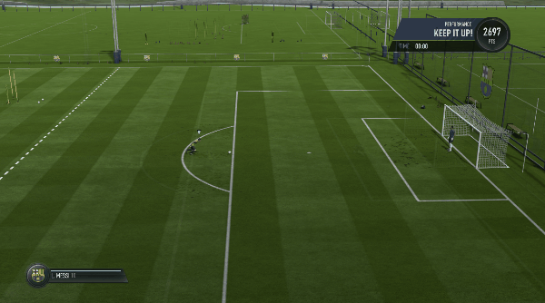
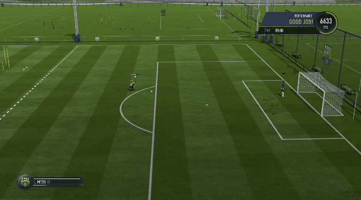

# DeepGamingAI_FIFARL
This repositiory contains code to train and run a model on FIFA 18 shooting skills. The model uses a Convolutional LSTM and is trained on a batch of sequences, using Reinforcement Learning. The models performace improves after about 100 epochs and you can start to see better scores.

The medium article for this project is available at [Reinforcement Learning with FIFA and Keras](https://medium.com/@lezwoncastellino/reinforcement-learning-with-fifa-and-keras-85ec792e25b2)

## Shots (Before training)

## Shots (After training)

## Instructions to run
1. Install requirements
2. Start game in 1280x720 dimensions in windowed mode (Opens by default in top left corner)
3. In FIFA 18, choose skill games and choose Bronze shooting.
4. Toggle the train_mode variable to run in train or test mode.
5. Run [main.py](main.py)
6. Make sure to click on FIFA window after starting program

## Note 
This repository is forked copy with lots of changes. The original was made for free kicks and is available at: [DeepGamingAI_FIFARL](https://github.com/ChintanTrivedi/DeepGamingAI_FIFARL)

## Setup Requirements
1. OS: Windows (FIFA 18)
2. Pytesseract
3. Tensorflow
4. Keras
5. MatplotLib

## Acknowledgements for code
1. [Chintan Trivedi](https://github.com/ChintanTrivedi)
2. [Deep Reinforcement Learning](https://medium.freecodecamp.org/deep-reinforcement-learning-where-to-start-291fb0058c01)
